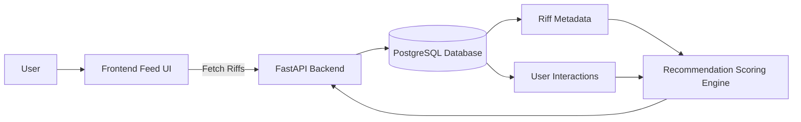
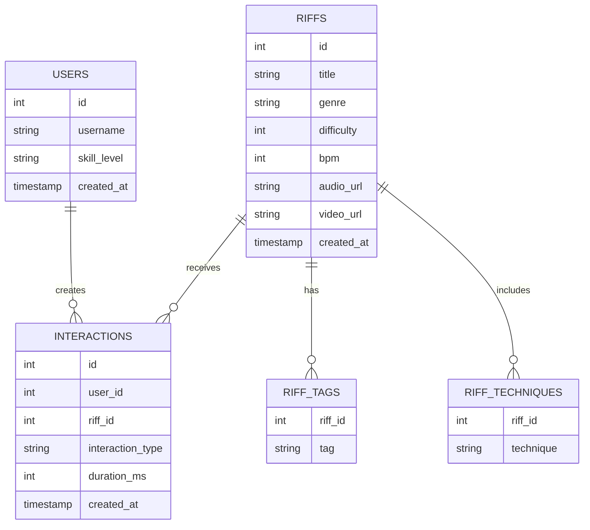
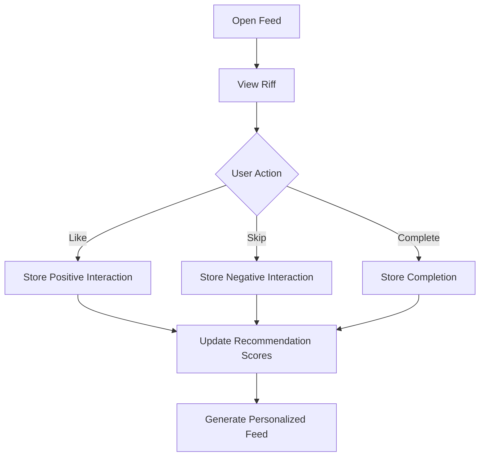
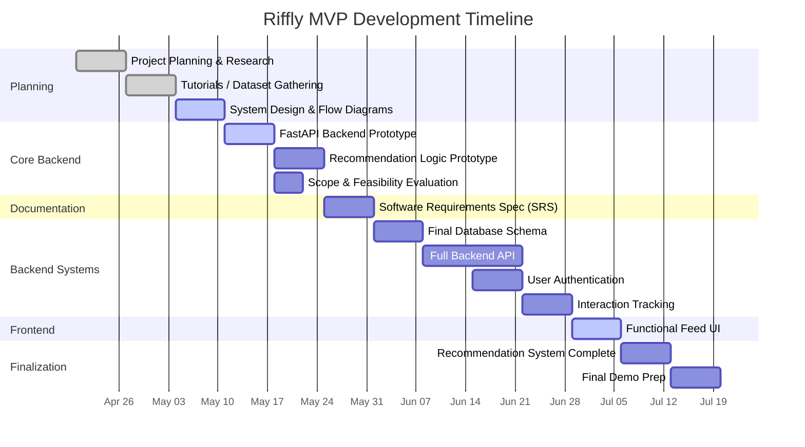

# Riffly

Riffly is a web-based personalized guitar learning platform focused on delivering short-form guitar riffs through a scrollable feed experience. The project explores how content-based recommendation systems and interaction-driven ranking can improve engagement and learning for beginner and intermediate guitar players.

---

## Current Status

The project is currently in early MVP development.

### Completed / In Progress
- Scrollable riff feed prototype
- Structured riff metadata model
- Initial backend setup with FastAPI
- System architecture planning
- Recommendation system research

### Current Focus
- Backend API development
- Database schema implementation
- Interaction tracking system
- Recommendation system prototype

---

## Tech Stack

- **Frontend:** HTML, JavaScript  
- **Backend:** FastAPI (Python)  
- **Database:** PostgreSQL
- **Recommendation System:** Content-based filtering (MVP; extensible to hybrid or learning-to-rank models)
- **Version Control:** Git + GitHub

## Project Goal

To explore how real-time interaction signals can be used to drive personalized learning in a short-form, feed-based educational system.

---

## Planned Features

- Infinite scrolling riff feed
- User interaction tracking (likes, skips, favorites, completions)
- Personalized recommendations
- Automatic audio preview playback while scrolling
- Guitar tab rendering
- Difficulty and technique tagging
- Authentication system
- Recommendation scoring engine

---

## System Architecture



---

## Riff Data Model

Each riff represents a short guitar learning snippet containing audio, optional video, and structured musical metadata.

### Core Riff Structure
```json
{
  "id": 1,
  "title": "Blues Riff in A Minor",
  "description": "Simple minor blues riff using hammer-ons and a pentatonic shape.",
  "media": {
    "audio_url": "https://example.com/audio/riff1.mp3",
    "video_url": "https://example.com/videos/riff1.mp4"
  },
  "difficulty": 2,
  "bpm": 90,
  "genre": "blues",
  "tags": ["blues", "beginner", "minor"],
  "techniques": ["hammer-on"],
  "tabs": {
    "e": "----------------|",
    "B": "----------------|",
    "G": "-----5h7--5-----|",
    "D": "--7-------------|",
    "A": "----------------|",
    "E": "----------------|"
  }
}
```

---

## Database Design

The database supports a feed-based recommendation system driven by user interactions.

### Core Tables


---

## Data Model Philosophy

The system is designed around a feed-based recommendation model where user behavior is more important than explicit ratings.

Instead of relying on star ratings or manual feedback, the system uses implicit signals such as:

- Interaction type (like, skip, complete)
- Engagement duration (time spent on a riff)
- Content similarity (tags, techniques, genre overlap)

This allows the recommendation system to evolve from simple content filtering into behavior-driven ranking over time.

---

## Recommendation System

The MVP recommendation system uses a content-based scoring approach that ranks riffs based on similarity to previously engaged content.

### Ranking Signals

#### Content Features

- Genre similarity
- Technique overlap (e.g., hammer-ons, bends, slides)
- Difficulty proximity
- Tag matching

#### User Behavior Signals

- Likes (positive signal)
- Skips (negative signal)
- Completions (strong positive signal)
- Time spent on riff (implicit engagement weight)

### MVP Scoring Approach

Riffs are ranked using a weighted scoring function combining:

- Content similarity to previously engaged riffs
- Recency bias
- Engagement strength from interaction history

This system is designed to evolve into a hybrid or learning-to-rank model in future iterations.

## User Interaction Flow

### Interaction Flow Diagram


---

## Development Timeline



---

# Running the Project

## 1. Clone the Repository

```bash
git clone <repo-url>
```

## 2. Start the Backend

```bash
cd backend
uvicorn main:app --reload
```

Run this command from the directory containing `main.py`.

## 3. Open the Frontend

Open `index.html` directly in your browser.

---

# Author

Zachary McLaughlin
