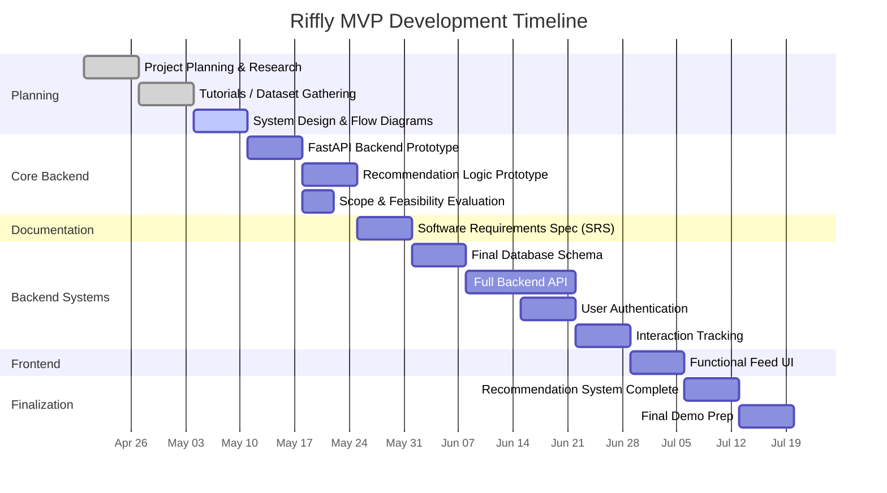

# Riffly

Riffly is a web-based project where I am building a personalized guitar learning platform. The goal is to deliver short-form guitar riffs to users and explore how recommendation systems can improve engagement and learning.

## Current Status

This project is in the early development phase. Current work is focused on:

* Researching recommendation systems
* Designing data models
* Building small backend prototypes

## Planned Components

* Backend API (FastAPI)
* Database for riffs, users, and interactions
* Basic recommendation system (content-based)
* Simple frontend for displaying a riff feed



## Running the Project

#### 1. Clone the repository
```
git clone <repo-url>
```
```
cd backend
```
#### 2. Start the backend server
```
uvicorn main:app --reload
```
Make sure you run this from the directory where main.py is located.  

#### 3. Open the frontend

Open index.html directly in your browser.

## Author

Zachary McLaughlin
