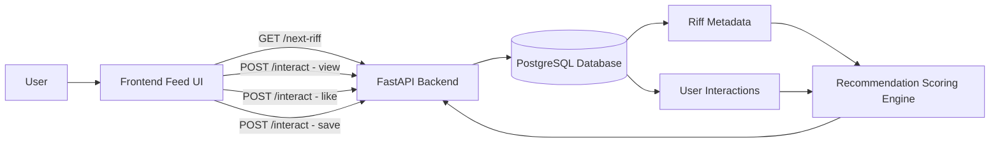
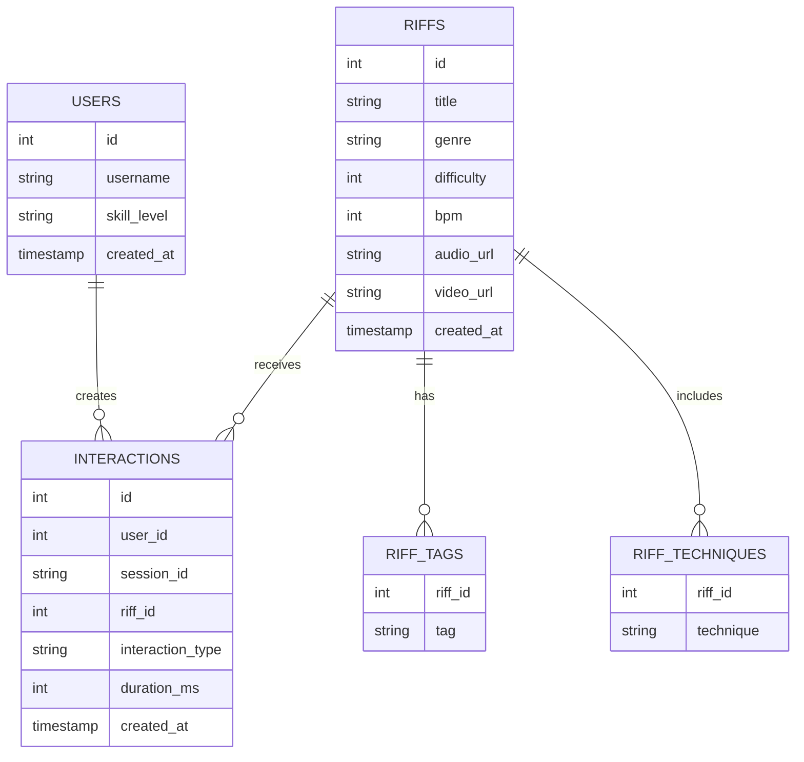
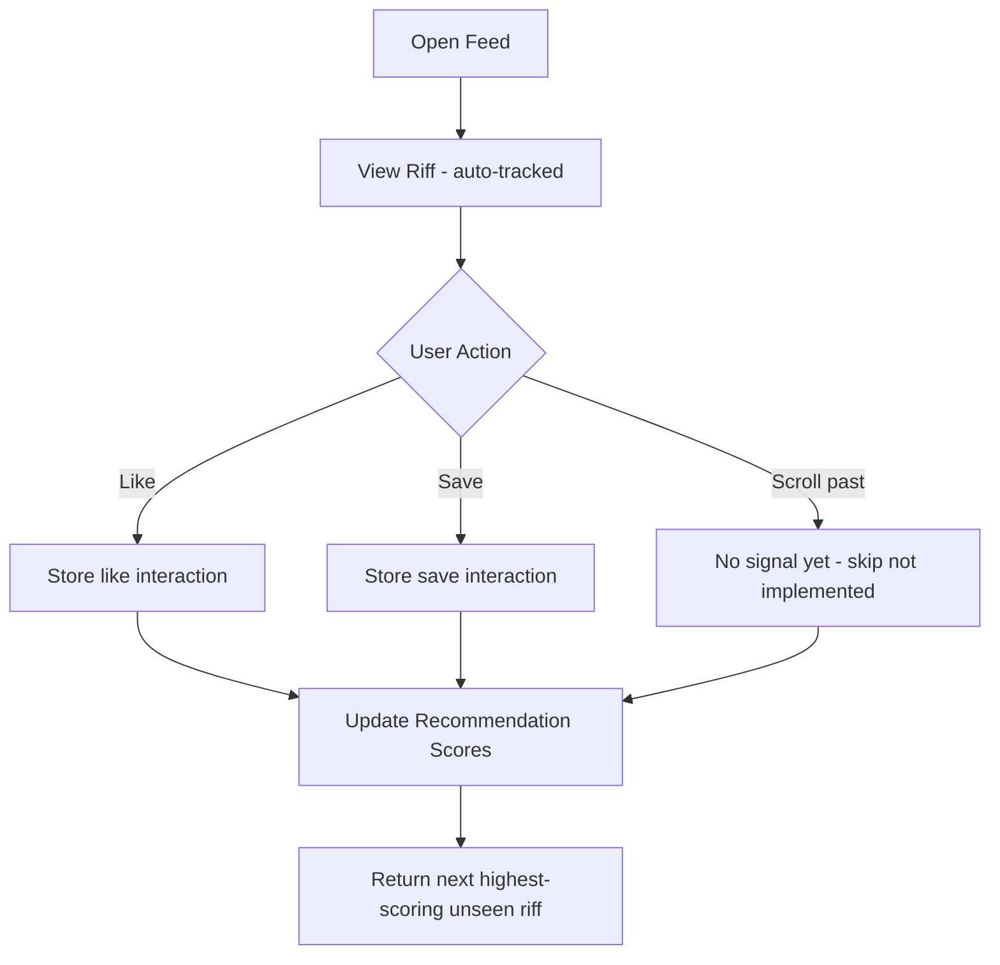
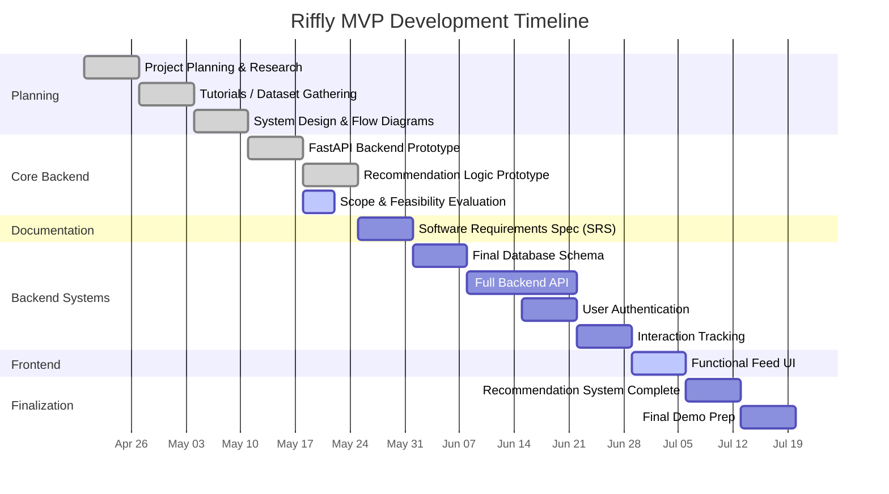

# Riffly

Riffly is a web-based personalized guitar learning platform focused on delivering short-form guitar riffs through a scrollable feed experience. The project explores how content-based recommendation systems and interaction-driven ranking can improve engagement and learning for beginner and intermediate guitar players.

---

## Current Status

The project is in active MVP development.

### Completed
- Scrollable riff feed with infinite scroll and lookahead loading
- Automatic view tracking on card render
- Like and Save interactions wired to backend
- Session-based identity (no login required)
- Duplicate prevention via `seen` Set (client-side)
- FastAPI backend with PostgreSQL integration
- Database schema implementation
- Interaction tracking system (session-based)
- Content-based recommendation engine (MVP)
- Animated fretboard note renderer with playhead
- Difficulty-based color theming
- Tone.js audio playback (PolySynth, triangle oscillator)
- Pause/resume on tap
- Splash screen with audio context initialization

### In Progress
- Scope and feasibility evaluation
- Software Requirements Spec (SRS)

### Planned
- Skip interaction
- Audio preview playback on scroll
- Guitar tab rendering (styled)
- Difficulty and technique tagging UI
- User authentication

---

## Tech Stack

- **Frontend:** React (functional components + hooks), Tone.js
- **Backend:** FastAPI (Python)
- **Database:** PostgreSQL (via SQLAlchemy)
- **Recommendation System:** Content-based filtering (MVP; extensible to hybrid or learning-to-rank models)
- **Version Control:** Git + GitHub

---

## Project Goal

To explore how real-time interaction signals can be used to drive personalized learning in a short-form, feed-based educational system.

---

## System Architecture



---

## API Endpoints

| Method | Endpoint | Description |
|--------|----------|-------------|
| `GET` | `/riffs` | Returns all riffs |
| `POST` | `/interact` | Records a user interaction |
| `GET` | `/next-riff?session_id=` | Returns the next recommended riff for a session |

### Interaction Request Body

```json
{
  "riff_id": 1,
  "interaction_type": "like",
  "duration_ms": 4200,
  "session_id": "abc123"
}
```

`duration_ms` is optional. Currently `view`, `like`, `unlike`, `save`, and `unsave` are sent by the frontend.

---

## Frontend

### Session Identity

A session ID is generated on page load using `crypto.randomUUID()` and attached to every interaction request. No login is required.

```js
const sessionId = useRef(crypto.randomUUID());
```

### Feed Loading

The feed pre-loads two riffs on init, then uses a `scroll` event listener with a lookahead threshold to fetch the next riff before the user reaches the bottom.

```
scrollHeight - scrollTop - clientHeight < clientHeight * 0.5  ← triggers load
```

A `seen` Set prevents duplicate cards from rendering if the same riff ID is returned. A `lockRef` prevents concurrent fetch calls during scroll.

### Interaction Tracking

| Interaction | Trigger |
|-------------|---------|
| `view` | Fired automatically when a card is added to the DOM |
| `like` / `unlike` | Fired when the user clicks the Like button |
| `save` / `unsave` | Fired when the user clicks the Save button |

Skip is not yet implemented.

### Playback

Each `RiffCard` runs a `setInterval` loop (16ms) that:
- Advances playback time using `performance.now()`
- Loops seamlessly based on riff duration
- Triggers Tone.js note events via `triggerAttackRelease` at the correct beat offset
- Pauses and resumes on tap, preserving playback position via `pausedTimeRef`

Audio uses a `PolySynth` with a triangle oscillator per card, disposed on unmount.

### Fretboard Renderer

Notes scroll from right to left past a fixed playhead. Position is calculated per-frame:

```
x = (note.start × PX_PER_BEAT) - (time - LEAD_IN) × SPEED + PLAYHEAD_X
```

A 3-beat lead-in gives the user time to prepare before the first note hits the playhead. Active notes scale up and glow.

---

## Riff Data Model

Each riff represents a short guitar learning snippet containing structured musical metadata and a list of timed note events.

```json
{
  "id": 1,
  "title": "Blues Riff in A Minor",
  "genre": "blues",
  "difficulty": 2,
  "bpm": 90,
  "key": "A minor",
  "tags": ["blues", "beginner", "minor"],
  "techniques_global": ["hammer-on"],
  "tuning": "standard",
  "events": [
    { "start": 0, "duration": 0.5, "string": 3, "fret": 5, "technique": "hammer-on" },
    { "start": 0.5, "duration": 0.5, "string": 3, "fret": 7, "technique": "hammer-on" }
  ]
}
```

`start` and `duration` are in beats. String numbers follow guitar convention (1 = high e, 6 = low E).

---

## Database Design



> **Note:** User authentication is not yet implemented. Interactions are tracked by `session_id`, with `user_id` hardcoded to `1` during the MVP phase.

---

## Recommendation System

The MVP recommendation system scores unseen riffs based on interaction history within the current session, then returns the highest-scoring one.

### Scoring Table

| Signal | Score Delta | Notes |
|--------|-------------|-------|
| Riff genre matches a liked riff's genre | `+0.5` | Applied to all unseen riffs in that genre |
| `view` interaction on riff | `+0.1` | Mild positive signal |
| `like` interaction on riff | `+3.0` | Strong positive signal |

Riffs that have already received any interaction are excluded entirely from recommendations.

### Interaction Flow



### Future Directions

- Skip as a negative signal
- Completion and `duration_ms` as engagement weight
- Technique and tag overlap scoring
- Difficulty proximity weighting
- Hybrid or learning-to-rank model

---

## Data Model Philosophy

The system is designed around a feed-based recommendation model where user behavior is more important than explicit ratings. Rather than star ratings or manual feedback, it uses implicit signals interaction type, engagement duration, and content similarity allowing the recommendation engine to evolve from simple content filtering into behavior-driven ranking over time.

---

## Development Timeline



---

## Running the Project

### 1. Clone the Repository

```
git clone https://github.com/Zachwm/riffly
```

### 2. Set Up the Database

Make sure PostgreSQL is running and create a database named `riffly`. Then create a `.env` file in the project root with your Postgres password:

```
POSTGRES_PASSWORD=your_password_here
```

The app reads this via `python-dotenv` without it, the database connection will fail.

### 3. Seed the Database

Run `restart_db.py` to reset the schema and seed the database with initial riff data:

```
python restart_db.py
```

This will drop and recreate all tables, then populate them via `backend/scripts/seed_db.py`.

### 4. Start the Backend

```
uvicorn backend.main:app --reload
```

### 5. Start the Frontend

```
npm install
npm run dev
```

---

## Author

Zachary McLaughlin