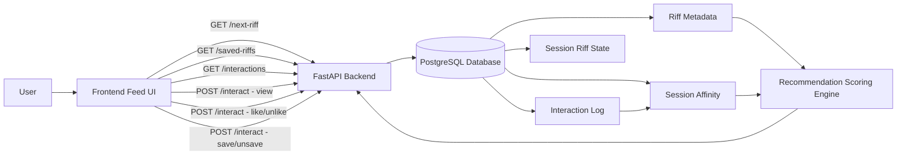
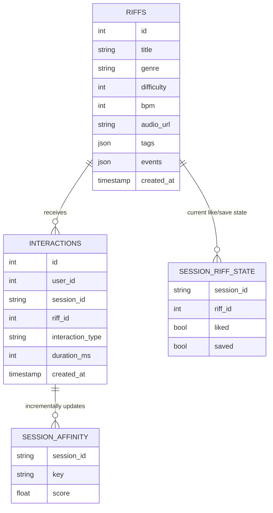
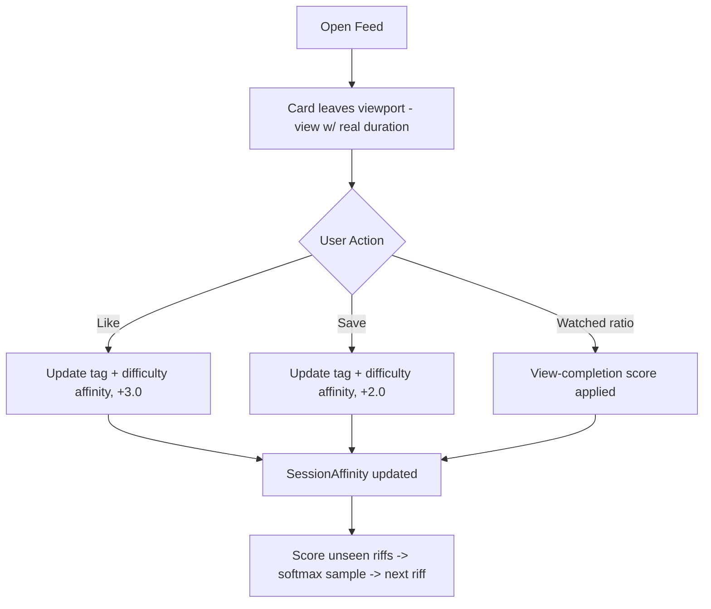

# Riffly

**Status: Official Alpha Release**

Riffly is a web-based personalized guitar learning platform that delivers short-form guitar riffs through a scrollable, TikTok-style feed. It explores how interaction-driven, content-based recommendation can improve engagement and learning for beginner and intermediate guitar players — scroll to a riff, watch its tab notation scroll past a playhead in sync with real audio, adjust tempo/volume, and like/save the ones you want to keep. No login required.

---

## Feature Scope

This alpha implements the full Must-Have requirement set (Section 2a, REQ-1–10) from the SRS (`Riffly_SRS_v1`, v1.2), plus three of its four Stretch requirements (Section 2b, STRETCH-1–4).

### Must-Have Requirements — implemented
- **REQ-1** Scrollable feed with infinite scroll — snap-scrolling feed, lookahead prefetch of the next riff before the last card is reached
- **REQ-2** Personalized recommendation via cookie-token history — session-scoped affinity across tags and difficulty, scored and returned by `GET /next-riff`
- **REQ-3** Interaction tracking with persistent cookie identity — UUID cookie generated on first visit, reused on return visits, with `view`/`like`/`save` all scoped to it
- **REQ-4** Guitar tab notation display — all 6 string rows rendered per card, styled fretboard with technique markers
- **REQ-5** Audio preview playback — Tone.js playback starts automatically as a card enters the viewport
- **REQ-6** Save interaction — Save button records a `save` interaction and shows visual confirmed state
- **REQ-7** Riff dataset of at least 50 entries — `riffs.json` contains 50 riffs, each with non-null title, genre, difficulty, BPM, tags, and tab events
- **REQ-8** DOM memory cap — older cards are trimmed as you scroll past them (capped around the spec'd ~10 concurrently mounted cards)
- **REQ-9** Backend API returns riff data as JSON — all endpoints (`/riffs`, `/next-riff`, `/saved-riffs`, `/interactions`) return serialized JSON
- **REQ-10** Saved Riffs page — bookmark-icon-accessible slide-in panel listing all saved riffs, finite/scrollable, no further recommendations

### Stretch Requirements — implemented
- **STRETCH-2** Engagement-weighted recommendations via `duration_ms` — view-completion scoring: watching past a pivot point is a positive signal, bailing out early is a negative one, scaled by how early
- **STRETCH-3** Rewatch signal — not a separate interaction type; the `view` handler has no dedupe check (unlike like/save), so watching the same riff again applies another `view_completion_score` on top of the first, compounding the affinity boost for a rewatched riff
- **STRETCH-4** Skip signal as negative feedback — not a separate interaction type; `view_completion_score` uses a 0.8-completion pivot, so any view that ends before 80% produces a negative score that lowers that riff's tag/difficulty affinity

### Also implemented (supporting infrastructure, not directly a numbered REQ)
- `seen`/like/save state mirrored to `localStorage`, namespaced per session, so the UI is instant and survives refreshes
- Optimistic UI + backend reconciliation for Like/Save
- Settings panel with a two-tap-confirm feed reset (new session, cleared local history)
- Per-card BPM slider (snaps back to original tempo) and volume slider
- Dedicated per-note synth for bends, so bending one note doesn't detune other ringing notes

### Not in this release
- **STRETCH-1** Filter or sort the feed by difficulty or technique tag
- User authentication — everything is scoped to the anonymous session cookie, with `user_id` hardcoded to `1`; the `users` table exists in the schema but is reserved for future use

---

## Tech Stack

- **Frontend:** React (functional components + hooks), Tone.js — deployed on [Railway](https://railway.com)
- **Backend:** FastAPI (Python) — deployed on Railway
- **Database:** PostgreSQL (via SQLAlchemy) — Railway-managed Postgres
- **Recommendation System:** Content-based filtering with session-level affinity + softmax sampling, extensible to hybrid or learning-to-rank models
- **Version Control:** Git + GitHub

---

## Project Goal

To explore how real-time interaction signals can drive personalized learning in a short-form, feed-based educational system.

---

## System Architecture



----

## API Endpoints

| Method | Endpoint | Description |
|--------|----------|-------------|
| `GET` | `/riffs` | Returns all riffs (debug/seeding use) |
| `GET` | `/next-riff?session_id=&exclude=` | Returns the recommender's pick for the next riff |
| `GET` | `/saved-riffs?session_id=` | Returns every riff the session has saved |
| `GET` | `/interactions?session_id=&riff_id=` | Returns current `{like, save}` state for one riff + session |
| `POST` | `/interact` | Records a `view`, `like`, `unlike`, `save`, or `unsave` event |

The live backend API is browsable at `https://backend-production-842c2.up.railway.app/docs` (FastAPI's auto-generated interactive docs).

### Interaction Request Body

```json
{
  "riff_id": 1,
  "interaction_type": "like",
  "duration_ms": 4200,
  "session_id": "abc123"
}
```

`duration_ms` is only meaningful for `view` events, and is optional otherwise.

---

## Frontend

### Session Identity

A session ID is a UUID stored in a long-lived cookie (`riffly_session_id`), created on first visit and reused on every later visit — not regenerated per page load. It's attached as a query param to every backend request. `seen` riff IDs and cached like/save state are mirrored to `localStorage`, namespaced by session ID, so a Settings-panel reset (which issues a new session) can't read back stale state from the previous session.

### Feed Loading

The feed prefetches two riffs on start. As you scroll, a `scrollend` listener recalculates the current card index, trims cards more than 8 behind it out of the DOM (correcting `scrollTop` in the same synchronous paint via `flushSync` so there's no visible jump), and fetches the next riff once you're within one card of the end of what's loaded.

A `seen` Set (persisted to `localStorage`) prevents the same riff from being queued twice client-side; a `lockRef` prevents overlapping fetches while one is in flight.

### Interaction Tracking

| Interaction | Trigger |
|-------------|---------|
| `view` | Fired when a card leaves the viewport, with its *actual* on-screen dwell time (via `IntersectionObserver`); views under ~300ms are dropped as not meaningful |
| `like` / `unlike` | Fired when the user taps the Like button |
| `save` / `unsave` | Fired when the user taps the Save button |

Skip and rewatch aren't separate interaction types — both are folded into `view` scoring on the backend: a `view` that ends before 80% completion applies a negative score (skip signal), and repeat views of the same riff aren't deduped, so rewatching compounds the affinity boost (rewatch signal).

### Playback

Each `RiffCard` runs a 25ms interval loop that:
- Advances playback time using `performance.now()`
- Loops seamlessly based on the riff's total beat length
- Schedules Tone.js note events (`triggerAttackRelease`) ahead of time via a small lookahead window
- Pauses and resumes on tap, preserving playback position
- Routes bent notes through a short-lived, dedicated `Tone.Synth` per note (rather than detuning the shared `PolySynth`) so a bend doesn't pull other ringing notes out of tune

Audio uses one shared `PolySynth` (triangle oscillator) across all cards, plus per-note synths for bends, disposed after their release tail finishes.

### Fretboard Renderer

Notes scroll from right to left past a fixed playhead. Position is calculated per-frame:

```
x = (note.start × PX_PER_BEAT) - (time - LEAD_IN) × SPEED + PLAYHEAD_X
```

A lead-in gives the user time to prepare before the first note hits the playhead. Active notes scale up and glow; palm-mutes, bends, slides, hammer-ons/pull-offs, and taps each have distinct rendering (badges, bend-arc overlays, palm-mute bracket spans).

---

## Riff Data Model

```json
{
  "id": 1,
  "title": "Blues Riff in A Minor",
  "genre": "blues",
  "difficulty": 2,
  "bpm": 90,
  "audio_url": null,
  "tags": ["blues", "beginner", "minor"],
  "events": [
    { "start": 0, "duration": 0.5, "string": 3, "fret": 5, "technique": "hammer-on" },
    { "start": 0.5, "duration": 0.5, "string": 3, "fret": 7, "technique": "hammer-on" }
  ]
}
```

`start` and `duration` are in beats. String numbers follow guitar convention (1 = high e, 6 = low E). `events` may arrive from the backend as a JSON string or already-parsed array; the frontend normalizes it either way.

`audio_url` exists as a column on `Riff` but isn't used by playback — audio is synthesized client-side by Tone.js directly from `events`, not streamed from a file. There is no `key` (musical key) column on the model; the frontend's `RiffCard` does reference `riff.key` for an optional "Key of ___" label, but since no riff data currently populates it, that label never renders. Add a `key` column (or drop the frontend reference) to reconcile this.

---

## Database Design



> User authentication is out of scope for this release. Interactions are tracked entirely by `session_id`, with `user_id` hardcoded to `1`. `SessionAffinity` holds each session's running score per `tag:<name>` / `difficulty:<level>` key; `SessionRiffState` holds the current like/save booleans per (session, riff) so toggles don't double-apply score deltas and `/interactions` / `/saved-riffs` can be read directly without replaying the interaction log. The raw `Interaction` log is kept as an audit trail / replay source if scoring weights ever change.

---

## Recommendation System

Each session's affinity toward tags and difficulty levels is maintained incrementally as interactions happen, rather than recomputed from the full log on every read.

### Scoring

| Signal | Score Delta | Notes |
|--------|-------------|-------|
| `like` / `unlike` | ±3.0, split across the riff's tags, plus applied to its difficulty bucket | Only applied on an actual state change (no double-counting repeat likes) |
| `save` / `unsave` | ±2.0, split across tags + difficulty | Same de-dupe logic as like |
| `view` (completion) | `(watched_ratio - 0.8) × 3.0` | Positive if you watch past 80% of a riff, negative (and increasingly so) the earlier you bail |

At read time, `/next-riff` scores every unseen riff as `tag_affinity_sum + difficulty_affinity × 1.2` (difficulty weight tuned down from an earlier value that let one like completely dominate the score), then picks via **softmax-weighted random sampling** rather than always taking the top score — so a slight score lead doesn't mean the same riff family gets recommended every time.

### Exclusion logic

`/next-riff` excludes the union of the riffs the client says it's already queued (`exclude` param) and every riff the session has a real `view` interaction for server-side. Because client-queued riffs are marked "seen" immediately (before they're necessarily watched), the client's local set is usually the tighter constraint. When it's exhausted, the frontend clears its local `seen` set and retries — which is what lets the feed keep going by re-surfacing riffs that were scrolled past too quickly to register a real server-side view, without exactly repeating the riff you just saw.

### Interaction Flow



### Future Directions

- Technique and tag overlap scoring
- Difficulty proximity weighting
- Hybrid or learning-to-rank model
- Explicit "reset view history" endpoint for a clean feed loop

---

## Data Model Philosophy

The system is designed around a feed-based recommendation model where user behavior is more important than explicit ratings. Rather than star ratings or manual feedback, it uses implicit signals — interaction type, engagement duration, and content similarity — allowing the recommendation engine to evolve from simple content filtering into behavior-driven ranking over time.

---

## Deployment

Riffly is hosted on [Railway](https://railway.com) as three linked services in one project:

| Service | Purpose | Root Directory |
|---------|---------|-----------------|
| Frontend | React/Vite app, built and served as a static site | `/frontend` |
| Backend | FastAPI app | `/` (repo root — `main.py` imports as `backend.core.*`, so it needs the repo root as its working directory) |
| Postgres | Managed database | — |

**Key environment variables:**

| Service | Variable | Purpose |
|---------|----------|---------|
| Backend | `DATABASE_URL` | Auto-injected by Railway's Postgres plugin |
| Backend | `RIFFLY_ALLOWED_ORIGINS` | CORS allowlist — set to the frontend's public domain |
| Frontend | `VITE_API_URL` | Backend's public domain; baked into the JS bundle at build time, so changing it requires a redeploy, not just a restart |

---

## Running the Project Locally

### 1. Clone the Repository

```
git clone https://github.com/Zachwm/riffly
```

### 2. Set Up the Database

Make sure PostgreSQL is running and create a database named `riffly`. Then create a `.env` file in the project root with your Postgres password:

```
POSTGRES_PASSWORD=your_password_here
```

The app reads this via `python-dotenv` — without it, the database connection will fail. (In production, `DATABASE_URL` is used instead — see Deployment above.)

### 3. Seed the Database

Run the reset script to (re)build the schema and seed initial riff data:

```
python -m backend.scripts.reset_db
```

This drops and recreates all tables, then populates them via `backend/scripts/seed_db.py`.

### 4. Start the Backend

```
uvicorn backend.main:app --reload
```

By default the backend allows CORS from `http://localhost:3000` and `http://localhost:5173`. Override with a comma-separated list via:

```
export RIFFLY_ALLOWED_ORIGINS="http://localhost:3000,http://localhost:5173"
```

### 5. Start the Frontend

Create a `.env` (or `.env.local`) file inside `frontend/`:

```
VITE_API_URL=http://127.0.0.1:8000
```

Then run:

```
npm --prefix frontend run dev
```

---

## Author

Zachary McLaughlin
