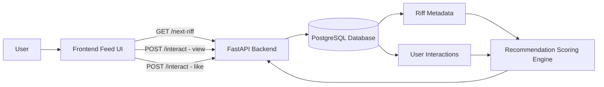
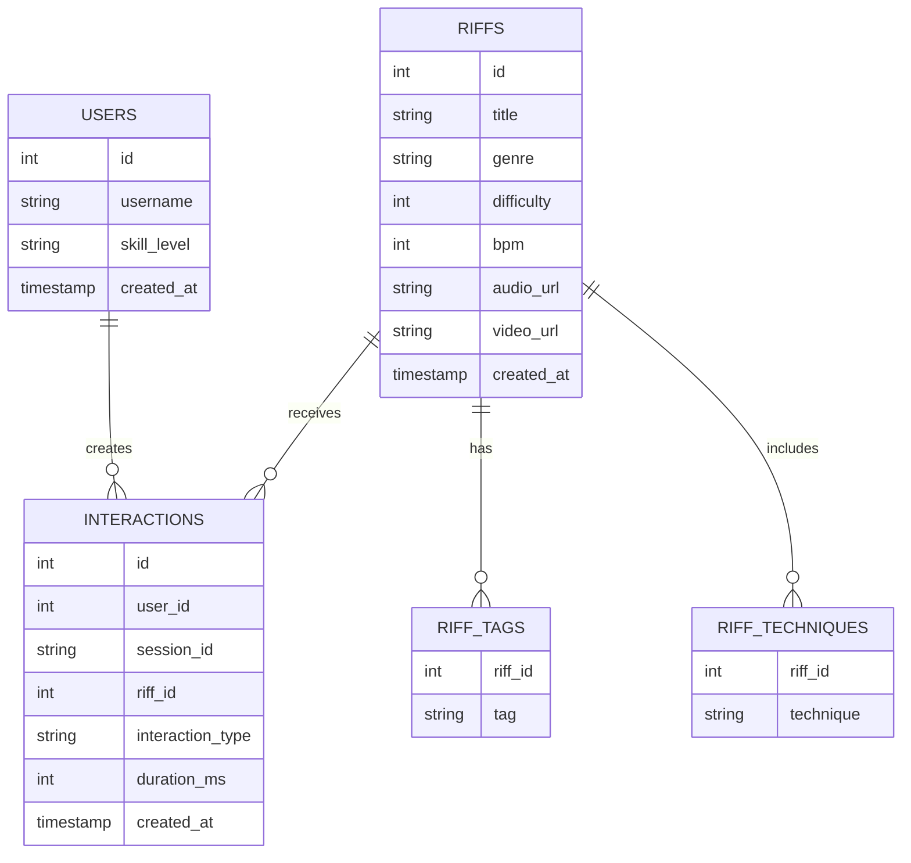
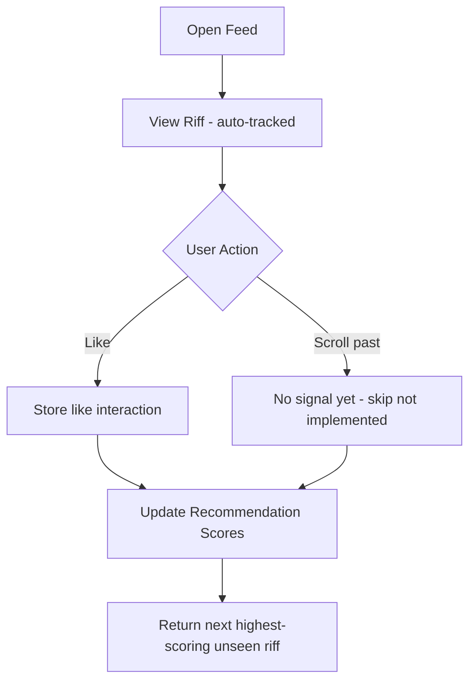
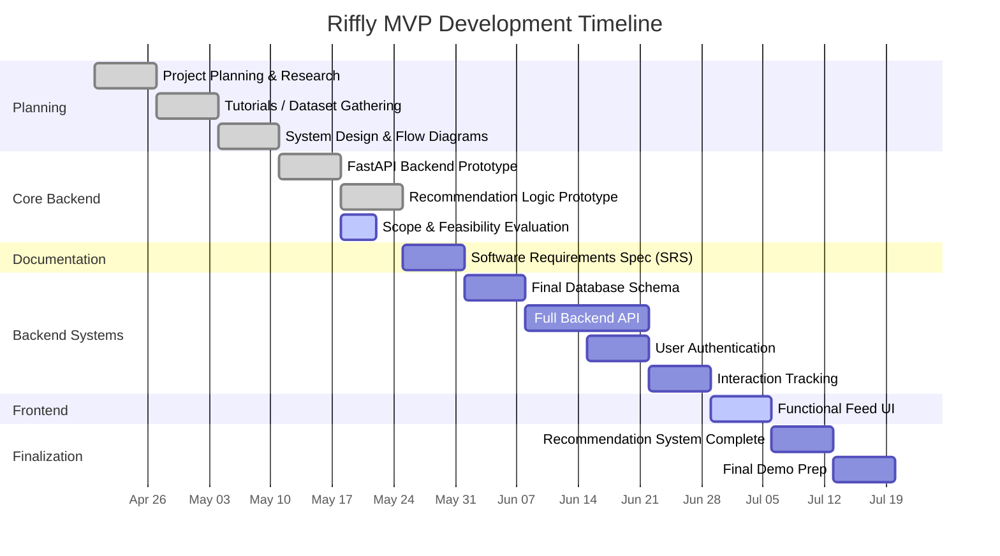

# Riffly

Riffly is a web-based personalized guitar learning platform focused on delivering short-form guitar riffs through a scrollable feed experience. The project explores how content-based recommendation systems and interaction-driven ranking can improve engagement and learning for beginner and intermediate guitar players.

---

## Current Status

The project is in active MVP development.

### Completed
- Scrollable riff feed with infinite scroll and lookahead loading
- Automatic view tracking on card render
- Like interaction wired to backend
- Session-based identity (no login required)
- DOM memory cap (10 cards max)
- FastAPI backend with PostgreSQL integration
- Database schema implementation
- Interaction tracking system (session-based)
- Content-based recommendation engine (MVP)

### In Progress
- Scope and feasibility evaluation
- Software Requirements Spec (SRS)

### Planned
- Skip interaction
- Audio preview playback on scroll
- Guitar tab rendering (styled)
- Difficulty and technique tagging UI
- User authentication

---

## Tech Stack

- **Frontend:** HTML, JavaScript (no framework)
- **Backend:** FastAPI (Python)
- **Database:** PostgreSQL (via SQLAlchemy)
- **Recommendation System:** Content-based filtering (MVP; extensible to hybrid or learning-to-rank models)
- **Version Control:** Git + GitHub

---

## Project Goal

To explore how real-time interaction signals can be used to drive personalized learning in a short-form, feed-based educational system.

---

## System Architecture



---

## API Endpoints

| Method | Endpoint | Description |
|--------|----------|-------------|
| `GET` | `/riffs` | Returns all riffs |
| `POST` | `/interact` | Records a user interaction |
| `GET` | `/next-riff?session_id=` | Returns the next recommended riff for a session |

### Interaction Request Body

```json
{
  "riff_id": 1,
  "interaction_type": "like",
  "duration_ms": 4200,
  "session_id": "abc123"
}
```

`duration_ms` is optional. Currently only `view` and `like` are sent by the frontend.

---

## Frontend

### Session Identity

A session ID is generated on page load using `crypto.randomUUID()` and attached to every interaction request. No login is required.

```js
let sessionId = crypto.randomUUID();
```

### Feed Loading

The feed pre-loads two riffs on init, then uses a `scrollend` listener with a lookahead threshold to fetch the next riff before the user reaches the bottom.

```
feedRect.bottom + feedRect.height  ← triggers load before last card is reached
```

A `seen` Set prevents duplicate cards from rendering if the same riff ID is returned.

### Interaction Tracking

| Interaction | Trigger |
|-------------|---------|
| `view` | Fired automatically when a card is added to the DOM |
| `like` | Fired when the user clicks the Like button |

Skip is not yet implemented on the frontend.

### DOM Memory Cap

To avoid unbounded DOM growth during long sessions, cards are pruned from the top of the feed once the count exceeds 10.

```js
function enforceLimit() {
  const cards = feed.querySelectorAll(".card");
  if (cards.length > 10) {
    cards[0].remove();
  }
}
```

---

## Riff Data Model

Each riff represents a short guitar learning snippet containing audio, optional video, and structured musical metadata.

```json
{
  "id": 1,
  "title": "Blues Riff in A Minor",
  "description": "Simple minor blues riff using hammer-ons and a pentatonic shape.",
  "media": {
    "audio_url": "https://example.com/audio/riff1.mp3",
    "video_url": "https://example.com/videos/riff1.mp4"
  },
  "difficulty": 2,
  "bpm": 90,
  "genre": "blues",
  "tags": ["blues", "beginner", "minor"],
  "techniques": ["hammer-on"],
  "tabs": {
    "e": "----------------|",
    "B": "----------------|",
    "G": "-----5h7--5-----|",
    "D": "--7-------------|",
    "A": "----------------|",
    "E": "----------------|"
  }
}
```

---

## Database Design



> **Note:** User authentication is not yet implemented. Interactions are tracked by `session_id`, with `user_id` hardcoded to `1` during the MVP phase.

---

## Recommendation System

The MVP recommendation system scores unseen riffs based on interaction history within the current session, then returns the highest-scoring one.

### Scoring Table

| Signal | Score Delta | Notes |
|--------|-------------|-------|
| Riff genre matches a liked riff's genre | `+0.5` | Applied to all unseen riffs in that genre |
| `view` interaction on riff | `+0.1` | Mild positive signal |
| `like` interaction on riff | `+3.0` | Strong positive signal |

Riffs that have already received any interaction are excluded entirely from recommendations.

### Interaction Flow



### Future Directions

- Skip as a negative signal
- Completion and `duration_ms` as engagement weight
- Technique and tag overlap scoring
- Difficulty proximity weighting
- Hybrid or learning-to-rank model

---

## Data Model Philosophy

The system is designed around a feed-based recommendation model where user behavior is more important than explicit ratings. Rather than star ratings or manual feedback, it uses implicit signals — interaction type, engagement duration, and content similarity — allowing the recommendation engine to evolve from simple content filtering into behavior-driven ranking over time.

---

## Development Timeline



---

## Running the Project

### 1. Clone the Repository

```bash
git clone https://github.com/Zachwm/riffly
```

### 2. Set Up the Database

Make sure PostgreSQL is running and create your database. Update the connection string in `backend/database.py`.

### 3. Start the Backend

```bash
uvicorn backend.main:app --reload
```

### 4. Open the Frontend

Open `index.html` directly in your browser.

---

## Author

Zachary McLaughlin