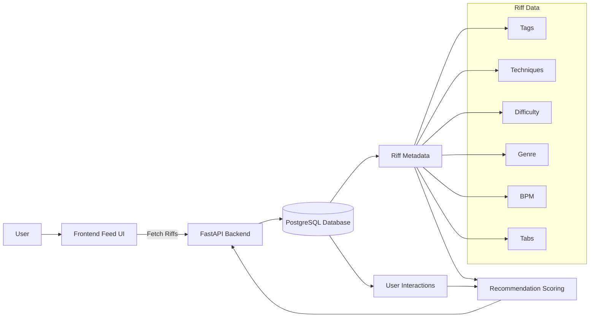
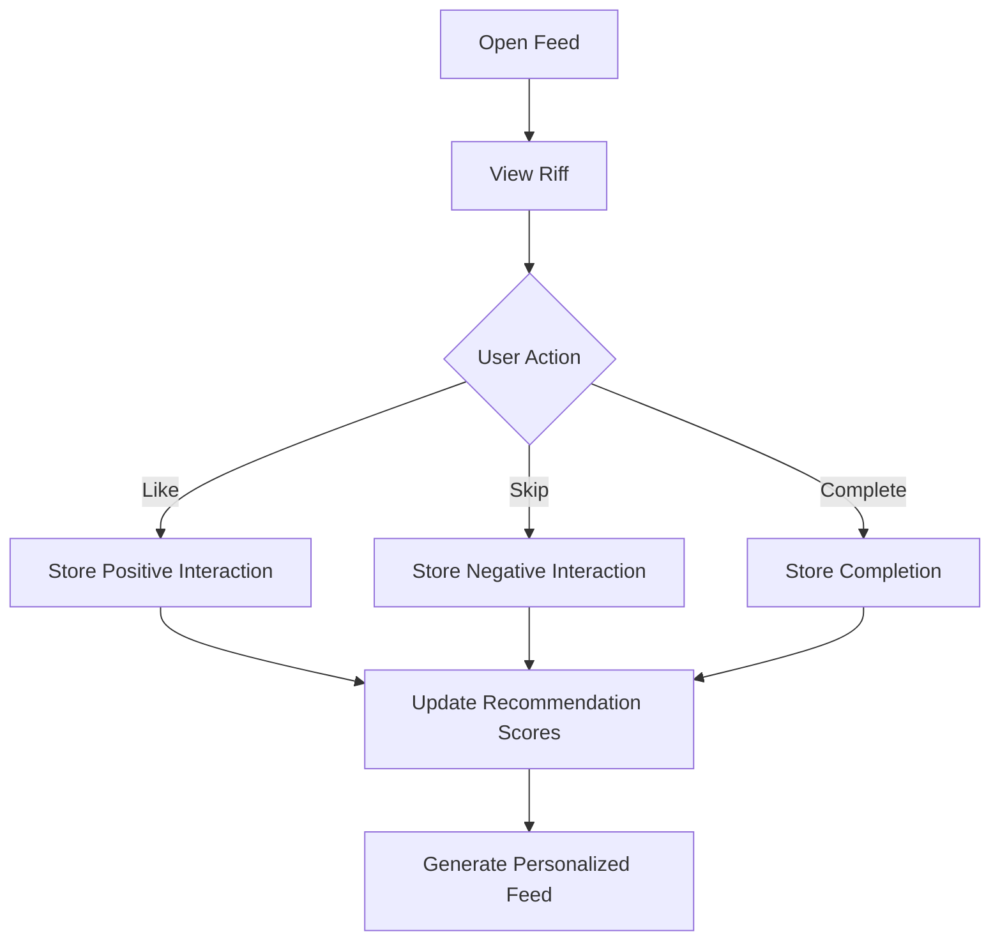
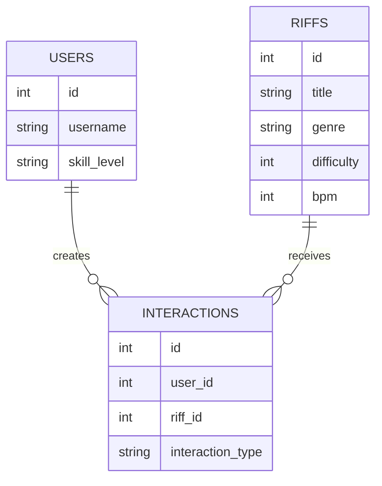
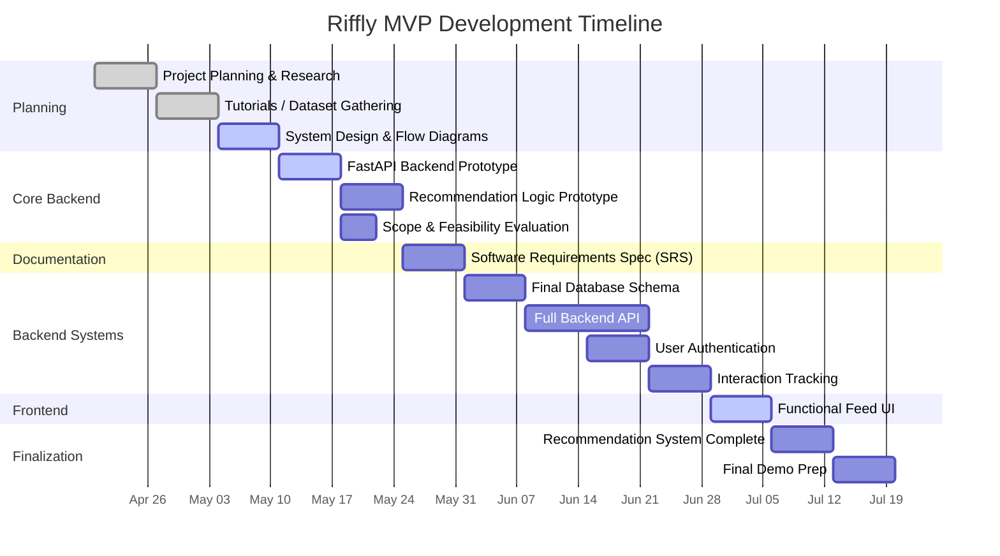

# Riffly

Riffly is a web-based personalized guitar learning platform focused on delivering short-form guitar riffs through a scrollable feed experience. The project explores how recommendation systems and interaction-driven ranking can improve engagement and learning for beginner and intermediate guitar players.

---

## Current Status

The project is currently in early MVP development.

Completed / In Progress:
- Scrollable riff feed prototype
- Structured riff metadata model
- Initial backend setup with FastAPI
- System architecture planning
- Recommendation system research

Current focus:
- Backend API development
- Database schema implementation
- Interaction tracking
- Recommendation prototype

---

## Tech Stack

- Frontend: HTML, JavaScript
- Backend: FastAPI (Python)
- Database: PostgreSQL
- Recommendation System: Content-based filtering
- Version Control: Git + GitHub

---

## Planned Features

- Infinite scrolling riff feed
- User interaction tracking
- Personalized recommendations
- Guitar tab rendering
- Difficulty and technique tagging
- Authentication system
- Recommendation scoring engine

---

# System Architecture



---

# User Interaction Flow



---

# Database Structure



---

# Development Timeline



---

# Example Riff Data Structure

```json
{
  "id": 1,
  "title": "Blues Riff in A Minor",
  "description": "Simple minor blues riff using hammer-ons and a pentatonic shape.",
  "video_url": "https://example.com/videos/riff1.mp4",
  "difficulty": 2,
  "bpm": 90,
  "genre": "blues",
  "tags": ["blues", "beginner", "minor"],
  "techniques": ["hammer-on"],
  "tabs": {
    "e": "----------------|",
    "B": "----------------|",
    "G": "-----5h7--5-----|",
    "D": "--7-------------|",
    "A": "----------------|",
    "E": "----------------|"
  }
}
```

---

# Running the Project

## 1. Clone the Repository

```bash
git clone <repo-url>
```

## 2. Start the Backend

```bash
cd backend
uvicorn main:app --reload
```

Run this command from the directory containing `main.py`.

## 3. Open the Frontend

Open `index.html` directly in your browser.

---

# Author

Zachary McLaughlin
